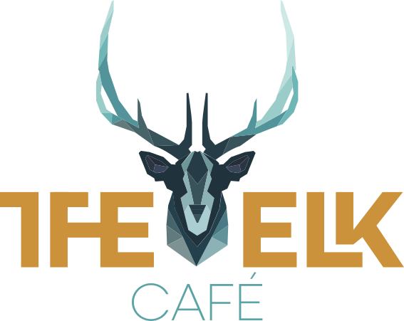

#  Final Integrated Project

## Create a 3-page website with HTML and CSS, logo and layout also have to be made with Adobe Illustrator and Adobe Photoshop

### Prerequisites

Chosen Subject for website: The Elk Café

3 pages: index.html (Home), menu.html (Menu), contact.html (Contact)

Designed logo, wireframe and edited images located in `assets` folder.

Resized and used images located in `images` folder

### Author
My Tu Tran

### License

MyTuTran © 2019